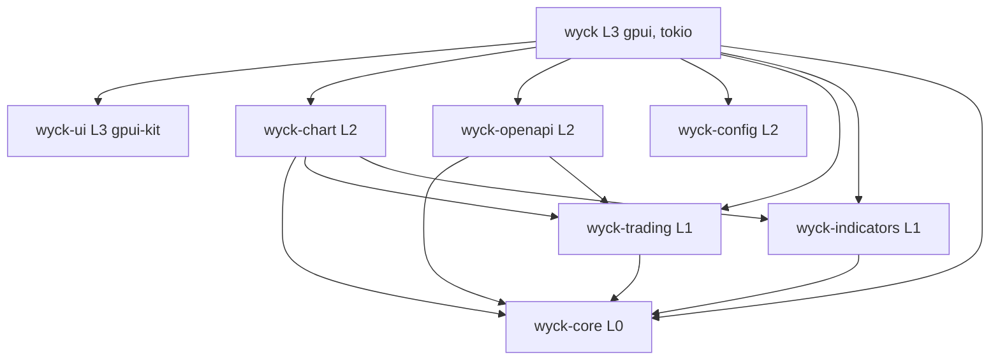
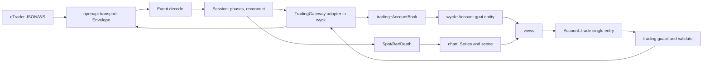

# Workspace restructuring plan

Status: approved plan, nothing implemented yet. Source of truth for tasks: `TASKS.md`. Current state: `PROGRESS.md`. Risks: `RISKS.md`. Audit evidence: `audit/`.

Decisions taken with the maintainer:

1. Targeted split into about 9 crates (including `xtask`), not the 12 to 16 of the original brief.
2. cTrader connection is hardened, not rewritten. The wire format stays JSON over WebSocket. There is no protobuf in this repo.
3. Feature freeze, except the indicator inputs work (symbol, source, timeframe, offset, groups).
4. Modest live-trading safeguards: one order entry point, audit log, stricter live confirmation. No kill switch.

Defaults: English for all repo text, crate prefix `wyck-`, platforms Linux, Windows and macOS (CI already covers them).

Evidence rule: every claim cites `path:line` and a symbol. "Not verified" means not confirmed in code. Line numbers come from the audit at commit `c805e65` and drift as code moves.

## 1. Executive summary

The brief assumed a messy workspace with no virtual manifest, no `AGENTS.md` and a protobuf client. The audit found the plumbing already healthy: virtual manifest, `[workspace.dependencies]`, CI on 3 OS with `clippy -D warnings`, `deny.toml`, `unsafe` forbidden, about 9 runtime `unwrap/expect/panic!`, close to 900 tests. The weak point is where code lives.

Measured state: 5 crates, 123,721 lines of Rust (`wyck` 56,217, `wyck-chart` 37,252, `wyck-openapi` 17,540, `wyck-config` 6,756, `wyck-ui` 5,956). `cargo check --workspace --all-targets` takes 1 min 37 s with 0 warnings. Default clippy with `-D warnings` currently fails on the stable toolchain 1.99.0: `clippy::approx_constant` at `wyck-chart/src/drawing/extras.rs:594` (`1.618_034` should be the golden ratio constant), so CI is red on a floating `stable` (T-010 fixes it first). Pedantic output (1949 warnings) is partial: clippy stopped at `wyck-chart`, so `wyck` and `wyck-ui` were not linted; redo it after the fix (T-012).

Five proven major problems:

1. Domain logic lives in the protocol crate: `wyck-openapi/src/trading/contract.rs`, `account/book.rs` (with UI strings), `market/*`, `Period`.
2. Pure logic lives in the app crate with no gpui dependency: `trading/guard.rs`, `trading/plan.rs`, parts of `trading/account.rs`, `services/alerts/{model,eval}.rs`, `chart/{load,raster}.rs`.
3. The UI bypasses `wyck-ui`: 83 direct `Button::new`, 30 files importing `gpui_kit`, 4 copies of `switch`, 143 literal `px(..)` in the app and 39 in `wyck-ui`, no size enum, no Select/Table/Tabs.
4. Indicator inputs have a spec but it is poor: everything is `f64`, no symbol, timeframe, session, string, group, inline or tooltip, `offset` on 4 indicators only, no multi-symbol.
5. Giant files and ambiguous names: 22 files over 800 lines in the app, 17 in chart and ui, 4 in openapi and config, `#[path]` modules, homonyms (`Plan` x4, `Kind` x3, `Tab` x3, `Symbol` x3).

Strategy: move before rewriting. Extract three pure crates (`wyck-core`, `wyck-trading`, `wyck-indicators`), add `xtask` with mechanical guards (arch-check, deny wrappers for gpui, ui-check), harden the connection, make `wyck-ui` the only door to gpui-kit, extend the input spec, then write the docs and agent rules. Every milestone leaves the workspace compiling and tested.

## 2. Verdict on H1 to H8

| # | Verdict | Evidence |
|---|---|---|
| H1 redundancy | Partial | No duplicate `Candle`, `Order` or `Position` (`Bar` is unique, `wyck-openapi/src/market/bars.rs:132`). Real duplicates: 3 symbol types (`market/symbols.rs:43`, `wyck/src/chart/mod.rs:290`, `wyck/src/multichart/mod.rs:51`); price scale conversion about 20 times (`account.rs:376`, `alerts/mod.rs:247`, `dashboard/trade.rs:641`); quote cache x4; `choice/switch/number` x3 or x4; `compact()` x3 with different formats; `dash_pattern` x2 that diverge; `price_text` vs `format_price`; `OpenApiTokens` vs `TokenSet`. AST and text duplication not measured (tools missing, M0). |
| H2 misplaced code | Confirmed | Problems 1 and 2 above, plus `AtrStop` and `PositionSettings::stats` in `wyck-chart` (third source of truth for sizing), cTrader fields in `wyck-config` `ProfileConfig` (`profile.rs:51-59`), `last_symbol` in `app_config.rs:31`. No upward dependency exists: the defect is placement, not direction. |
| H3 excess comments | Partial | Doc plus comment lines per code line: app 5.5 %, chart 7.5 %, ui 13 %, openapi src about 30 %, config src about 28 %. Noise: about 80 `/// ProtoOA...Req.` lines on constants (`wire.rs:31-218`), `/// The account id.` (`handle.rs:50`), `/// One minute.` (`bars.rs:18-45`). Central types (`Timeframe`, `Series`, `InputSpec`, `PlotSpec`) have no doc. |
| H4 inconsistent UI | Confirmed | Problem 3, plus `tokens::height::control()` = 28 vs `.large()` buttons = 32, menu widths not scaled, two text input stacks (`TextInput` vs gpui-kit `InputState`), weak `no_inline_colors` test (`appearance/mod.rs:808-898`). |
| H5 missing inputs | Confirmed | Problem 4. See section 4.3. |
| H6 fragile connection | Mostly refuted | Correlation, timeouts, rate limit, backoff, re-auth, resubscribe, refresh and secrets are present and tested (about 5000 lines of tests with a scripted local server). Missing: inbound silence watchdog, real state machine, transport trait, typed requests, error code enum, demo/live connection cap, `Lagged` recovery. See section 4.1. |
| H7 layout and tracking | Partial | Flat `crates/*` and virtual manifest already exist. Real issues: `#[path]` in `main.rs:3,18,22`, files over 800 lines, no `docs/`, no ADRs, `AGENTS.md` had only git and style rules. `utils/common/helpers` modules: not verified (grep in M0). |
| H8 AI mistakes | Confirmed | 10 traps in `audit/40-ai-friction.md`. No single verify command, no architecture rules written down, no GPUI test (`#[gpui::test]`: 0 uses). |

### Findings outside the hypotheses

- `assess` hardcodes `reduces: false` (`account.rs:368`): the `if order.reduces` branch (`guard.rs:253`) is dead in production.
- The live flag is display only (`header.rs:658`, `ticket/mod.rs:1984`) and has two diverging sources (`Environment::Live` in `connection/mod.rs:170`, `account.is_live` in `select_account.rs:152`).
- No order audit log. Drag of SL/TP and chart order cancel have no confirmation (`dashboard/trade.rs:645,708`); `confirm_close` can be switched off (`panel/prefs.rs:318`).
- `OpenApiTokens` to `TokenSet` conversion drops `obtained_at` (`wyck-config/src/tokens.rs`, `services/token_store.rs`).
- After the 15 s call timeout only the 2 s `DuplicateGuard` protects against a resend (`account.rs:43,905`, `guard.rs:343`).
- `panic!("not an extended indicator")` (`study/extended.rs:439`); `StudyKind::ALL` (50 items) is synced by hand.
- State mutation and table rebuilds inside `render` (`panel/view.rs:1534-1551`, `ticket/view.rs:574-582`, `multichart/mod.rs:1117-1137`); a per-second task per chart (`chart/mod.rs:536`).
- `Box::leak` capped at 4 MB for script specs (`study/custom/intern.rs:34-47`); global `REGISTRY: RwLock` in a model crate (`library.rs:84`).
- `Result<_, String>` in 10 places of the app; unbounded `std::sync::mpsc` (`services/alerts/sound.rs:302`).
- `transport` is `pub` (doc-hidden) only for integration tests; about 15 `pub` openapi items unused elsewhere (`UNITS_PER_PRICE`, a second `Contract::format_price`).
- Orphan comment about "MCP servers" in `bars.rs:15`.
- The project memory mentions a failing test (`tmp_fvg_script`) and a flaky one; re-measure in M0.

## 3. Target architecture

### 3.1 Layers

Dependencies point down only, never within the same layer.

| Layer | Crates | May depend on | Forbidden |
|---|---|---|---|
| 0 | `wyck-core` | no internal crate; chrono, chrono-tz, serde | gpui, tokio, rhai, I/O |
| 1 domain | `wyck-trading`, `wyck-indicators` | layer 0 | gpui, tokio, reqwest, tungstenite, `wyck-config` |
| 2 models and adapters | `wyck-chart`, `wyck-openapi`, `wyck-config` | layers 0-1 | gpui, other layer 2 crates |
| 3 presentation | `wyck-ui`, `wyck` | everything below | none; only `wyck` wires openapi, config and chart together |

Only `wyck-ui` and `wyck` may use `gpui` and `gpui-kit`. Only `wyck-openapi` (feature `client`) and `wyck` may use `tokio`. Enforced by `cargo xtask arch-check` (reads `cargo metadata` and `docs/architecture/layers.toml`) and by `cargo-deny` `[bans]` with `wrappers`.

No separate app or ports crate: cTrader is the only adapter. The `TradingGateway` trait lives in `wyck-trading`. No `ui-panels` crate: 56k lines of views in one crate do not justify a split yet (re-evaluate after M6 if iteration build time hurts).

### 3.2 Target crates

| Crate | Layer | Role | Main API | Migrates from | Why a crate | Risk |
|---|---|---|---|---|---|---|
| `wyck-core` | 0 | Market types and scale conversion, once | `Period`, `Bar`, `Tick`, `Quote`, `Price`, `Volume`, `Money`, `SymbolId`, `Symbol`, `SymbolTable`, `TradingHours`, `PRICE_SCALE`, `Clock` | `wyck-openapi/src/market/{price,bars,ticks,symbols,hours}.rs`, `chart::Symbol`, `multichart::SymbolRef` | Breaks the chart/openapi coupling; "no runtime" is checkable | medium |
| `wyck-trading` | 1 | Pure, deterministic trading rules | `Contract`, `lots_for_risk`, `live_net`, `SizeMode`, `AccountBook`, order types, `RiskPrefs`, `check`, `DuplicateGuard`, exit plans, `ReverseTracker`, `AtrStop`, `TradingGateway` | `wyck-openapi/src/{trading/contract.rs,account/book.rs,account/types.rs}`, `wyck/src/trading/{guard,plan,math}.rs`, pure parts of `account.rs`, `wyck-chart` `atr_stop.rs` and `position.rs::stats` | Isolates the riskiest rules; testable without gpui or network | high (serde types shared with the wire) |
| `wyck-indicators` | 1 | Studies, input specs, Rhai scripts | `StudyKind`, `Spec`, `InputSpec`, `InputKind`, `PlotSpec`, `StudyConfig`, `compute`, `custom::*` | `wyck-chart/src/study/**` | Isolates `rhai`; target of the inputs work; snapshot-testable | medium |
| `wyck-chart` | 2 | Chart models without gpui | `Series`, `Timeframe`, `drawing::*`, `scene::build`, `export::*`, `transform`, `raster` | rest of `wyck-chart`, plus `wyck/src/chart/{raster,load,live}.rs` | Already a crate; absorbs pure app code | medium |
| `wyck-openapi` | 2 | cTrader JSON/WebSocket protocol and session | `Client`, `Session`, messages, `Event`, `Error`, `Transport`, `TokenStore` | rest of `wyck-openapi` | Already a crate; becomes protocol only | medium |
| `wyck-config` | 2 | Config, encrypted secrets, backups | `WyckConfig`, `DocumentStore`, `SecretStore`, `BackupStore` | lighter `wyck-config` (cTrader fields isolated, `last_symbol` to a document) | Already a crate and healthy | low |
| `wyck-ui` | 3 | Only door to gpui-kit | `Size`, `tokens`, `theme`, `button`, `field`, `form`, `menu`, `modal`, `select`, `table`, `tabs`, `toast` | `wyck-ui` plus components rebuilt in the app | Isolates gpui-kit; checkable by `ui-check` | medium |
| `wyck` | 3 | Binary: wiring, screens, gpui entities | `main`, screens, thin `Account` entity | rest of `wyck` | Composition root | medium |
| `xtask` | n/a | Automation | `cargo xtask check`, `arch-check`, `ui-check`, `docs-check` | new | Replaces `scripts/check-config.sh`, one command for CI and hooks | low |

### 3.3 Old to new map (by module)

| Old | New |
|---|---|
| `openapi/market/{price,bars,ticks,symbols,hours}` | `core` |
| `openapi/market/{quotes,live,depth}` | `trading` (derived state); final call in T-044 |
| `openapi/market/{history,client}` | stays in `openapi` |
| `openapi/trading/contract.rs`, `account/book.rs` (without notices), `account/types.rs` | `trading` |
| `openapi/account/book.rs` `Tone`, `Notice`, `NoticeAction`, `explain`, `refusal`, `describe` | `wyck` (presentation) |
| `openapi/{transport,session,auth,margin,account/client,trading/{client,requests,events}}` | stays in `openapi` |
| `chart/study/**` | `indicators` (except `atr_stop.rs` to `trading`) |
| `chart/study/custom/library.rs` I/O and global registry | calculation stays in `indicators`; I/O and registry move to `wyck/src/indicators/` |
| `chart/{data,timeframe,drawing,scene,export,transform,volume,footprint,flow,tpo,axis,view,projection,display,settings,options,zone,text_scale,defaults,lines}` | stays in `chart`; `Timeframe` uses `core::Period`; `export/store.rs` to `wyck` |
| `chart/drawing/position.rs::stats` | `trading` (sizing); drawing keeps geometry |
| `app/trading/{guard,plan,math}.rs`, pure parts of `account.rs` | `trading` |
| `app/trading/{ticket,panel}/**`, `account.rs` entity | stays in `wyck`; `panel/data.rs` split (pure rows to `trading`) |
| `app/trading/panel/stats.rs` `csv_*` | `chart::export` |
| `app/chart/{raster,load,live}.rs` | `chart`; gpui painting stays in `wyck` |
| `app/services/alerts/{model,eval}` | `chart` or `indicators::alerts` (decided in T-051); `sound.rs` stays |
| `app/appearance/{contrast,presets}` | `wyck-ui::theme` |
| `app/workspace/preferences.rs`, `trading/{panel,ticket}/prefs.rs` | pure models to `config` documents or an app `prefs` module (T-051) |
| `app/multichart/{split,links}`, `dashboard`, `connection`, `settings_hub`, `indicators` editor, `title_bar`, `main`, `runtime` | stays in `wyck` |
| `config/*` | stays; cTrader fields and tokens isolated (T-052) |
| `ui/**` | stays, plus components lifted from the app |

### 3.4 Diagrams

### 3.5 ADR drafts (to write under `docs/adr/`)

- 0001 Layers and dependency rules, with enforcement.
- 0002 JSON over WebSocket stays, no protobuf (`wyck-openapi/src/config.rs:7-8`).
- 0003 Numeric policy: `Price`, `Volume`, `Money` are newtypes over scaled `i64` (cTrader native: price 1e5, volume in hundredths, money 10^moneyDigits), conversion only in `wyck-core`; `f64` only inside indicator math and display.
- 0004 One entry point for every order action.
- 0005 `wyck-ui` is the only door to gpui-kit; one size enum.
- 0006 No `ui-panels` crate until a measured build-time reason.
- 0007 gpui pinning and the bump procedure.

## 4. Workstreams

### 4.1 cTrader connection (harden)

| Requirement | Status | Action |
|---|---|---|
| State machine | Partial (`ConnectionState` of 2 values plus `AtomicBool`, `connection.rs:79-98`; flag-driven `supervise`, `session/mod.rs:661-792`) | `enum Phase` (Disconnected, Connecting, AppAuth, AccountAuth, Ready, Degraded, Reconnecting) and a pure transition function; drop `force_refresh` and `refreshed_for_invalid` |
| App auth then account auth | Present (caller convention) | Internal guard or light typestate, plus an order test |
| Heartbeat | Present (5 s, validated under 10 s) | Keep |
| Liveness watchdog | Absent (inbound heartbeats ignored, `connection.rs:133`) | Silence timeout leading to full reconnect; paused-time tests |
| Correlation, timeout, cleanup | Present (`connection.rs:94,110-120,158,450-472`) | Keep; add typed `Request` trait to remove the `u32` pair in `call` |
| Event channel | Present (broadcast, 8192) | On `Lagged` trigger a resync (`dashboard/mod.rs:468`) |
| Rate limit | Present (spacing 40/s and 4/s, burst about 0.2 s) | Keep, document; values were chosen after a live block (`config.rs:63-66`) |
| Backoff and jitter | Present | Keep |
| Resubscribe | Present (`session/mod.rs:892-939`) | Keep |
| Reconcile | Absent in the crate (present in app) | `SessionEvent::Resynced` and a documented contract |
| Account/client disconnect, token invalid, refresh | Present and tested | Keep |
| Typed errors | Partial (`code: String`, `error.rs:145`) | `ServerErrorCode` enum with `Unknown(String)` |
| Transport abstraction | Partial (`run` generic, `connect` not) | `Transport` trait, in-memory fake on `tokio::io::duplex`, migrate 3 tests |
| Two connections max | Partial | One `Session` per environment, guard in the app |
| Secrets | Good | Zeroize plain `String` copies in the app (`browser_handoff.rs:131`, `authorizing.rs:44`) |
| Degraded UI states | Partial | `Reconnecting` disables ticket and order buttons; stale quote indicator |

Out of scope: protobuf, raw TCP, third-party cTrader crates.

### 4.2 UI

- One size enum in `wyck-ui` drives both `tokens::height::*` and the button `.small()` and `.large()` calls. Defaults per context (toolbar small, forms medium) go in `docs/UI_GUIDELINES.md`. Fix the 28 vs 32 gap.
- Missing tokens: spacing, radius, scaled menu widths.
- Lift into `wyck-ui`: `select`, `tabs`, `table`, `switch_row`, `choice_row`, `number_row`, `card`, `tint`, `mono`, swatch row.
- Migration order: `multichart/drawing_ui.rs` (27 direct buttons), `dashboard/header.rs` and `picker.rs`, `settings_hub`, the four chart settings dialogs, `trading/panel`, `trading/ticket`, `indicators/editor`, `chart/overlay.rs`. Done means `ui-check` green plus before and after captures.
- `xtask ui-check` fails on `use gpui_kit::` outside `wyck-ui` (except `IconName`), literal `px(..)` in `wyck/src/**` outside a justified exception list, and color constructors outside `wyck-ui` and the chart palette. It replaces and extends `no_inline_colors`.
- GPUI fixes: no state mutation in `render` (`ticket/view.rs:574`, `panel/view.rs:1534`, `multichart/mod.rs:1117`), one quote cache, one `Event::Spot` dispatch (`dashboard/mod.rs:479-487`).
- Pinning: `gpui-pre 0.3.5` and `gpui-kit 0.6.6` already pinned in `[workspace.dependencies]`. Dependabot proposes 0.7.0; do not bump during the milestones. Write the bump procedure (skill `bump-gpui`).
- GPUI test support: check `#[gpui::test]` in `gpui-pre 0.3.5` before promising UI tests (T-008). Otherwise extract logic out of entities, which M3 and M4 do anyway.

### 4.3 Indicators and inputs

Keep: `InputSpec`, `InputKind`, `PlotSpec`, `Spec`, the generated dialog (`study_settings.rs:494`), the 50 indicators, Rhai scripts with their budgets (20M ops, 4 s).

| Input | Status | Action |
|---|---|---|
| bool, int, float, choice, color | Present, stored as `f64` | `ParamValue { Bool, Int, Float, Str, Color, Source, Timeframe, Symbol, Session }` with versioned migration |
| source (OHLC, hl2, hlc3, ohlc4) | Present | Extend: volume, plot of another indicator |
| offset | 4 indicators only | Common `offset` for all overlays |
| symbol, timeframe | Absent | New kinds; searchable select for symbol (from `SymbolTable`) |
| session, free string | Absent | New kinds |
| group, inline, tooltip, confirm | Absent (only `section` and a name heuristic, `run.rs:127`) | Fields on `InputSpec`, grouped generated form |
| per-plot style | Present (`PlotStyle`) | Keep |
| choice stored by index | Fragile | Stable identifiers |

Multi-symbol and multi-timeframe model: `StudyInput` receives series resolved from a `SeriesRequest { symbol, timeframe }` through an injected provider; the app subscribes to what is needed (modelled on `chart/history.rs:19-60` and `AtrStop.timeframe`). Two steps: first inputs on the chart symbol and timeframe, then external series. Replace the `panic!` in `extended.rs:439` with an `Option` and derive `StudyKind::ALL`.

Tests: snapshot the output of all 50 `StudyKind` on a fixed bar set before any move (M0); external reference values for RSI, MACD, EMA, Bollinger, ATR, Supertrend.

### 4.4 Domain and numeric policy

Market prices are scaled `i64` (1e5), volumes `i64` in hundredths, money `i64` at 10^moneyDigits, but order and position prices are `Option<f64>` (`account/types.rs:357-425`, `trading/requests.rs`), wire enums are raw `i64`, and scale conversion appears in 6 or more places (`price.rs`, `account/types.rs:212,218`, `trading/contract.rs:102-138` with a second `PRICE_DIGITS = 5`). Actions: `Price`, `Volume`, `Money` newtypes with one conversion point; typed enums for wire `i64`; id newtypes (`AccountId`, `SymbolId`, `OrderId`, `PositionId`); injectable `Clock` for `guard` and `plan`; make `Contract::from_symbol` forex defaults explicit (`contract.rs:60-73`). Do it in two steps (newtypes at the boundary, then private fields) because the wire serde shape is involved.

### 4.5 Hygiene and comment policy

- Remove doc comments that repeat the name; keep the "why". `pub(crate)` by default. Hide `transport` behind a `test-support` feature. Remove `UNITS_PER_PRICE`, the second `Contract::format_price`, the "MCP servers" comment, `// ----` separators, the 6 `#[allow(unused_variables)]` of `drawing_ui.rs`.
- File size target under 400 lines, alert at 600, function under 60. Split the biggest first.
- `Result<_, String>` becomes local `thiserror` enums.
- Workspace lints: add `unwrap_used`, `expect_used`, `dbg_macro`, `todo` as warn, plus a pedantic subset chosen from the count in `audit/00-baseline.md`.
- All repo text follows `AGENTS.md` (ASCII, no typographic dashes or quotes); run its one-liner each milestone.

### 4.6 Trading safety and tests

Ten behaviors never to break: (1) risk-based sizing rounds down to the lot step (`drawing/position.rs:219`); (2) orders with SL/TP on the wrong side are refused (`TicketProblem`, `trading/contract.rs:164-199`); (3) `NewOrderReq::validate` (`trading/requests.rs:106`); (4) one send per click (`Busy` set plus `DuplicateGuard`); (5) rate limit 40/s and 4/s; (6) token refresh is not cancellable, then persisted; (7) reconnect resubscribes; (8) secrets never logged, `Debug` masked; (9) demo/live shown correctly; (10) export and config document round trips (`atomic_write`).

Safeguards (modest): one `OrderIntent` for place, close, cancel, amend with a shared policy; `tracing` audit target on every send and result, no secrets; stricter confirmation in live, configurable; real `reduces`; visible "uncertain" state after a timeout; automated tests never touch a real account (live tests stay `#[ignore]` and need `WYCK_OPENAPI_ALLOW_LIVE_TRADING=1`).

### 4.7 Agent environment and docs

`AGENTS.md` and `CLAUDE.md` exist but `AGENTS.md` only covers git and writing style. Target (minimal in M1, full in M8): `AGENTS.md` under 200 lines (commands, layers, hard rules, traps) keeping the two current sections; `CLAUDE.md` with a Claude Code section; `.claude/rules/{domain,ui,ctrader,tests,docs}.md` with `paths:`; nested `CLAUDE.md` in `wyck-openapi` and `wyck-ui`; skills `add-indicator`, `add-ui-component`, `add-panel`, `bump-gpui`, `new-crate`; hooks (fmt after a `.rs` edit, reminder to run `cargo xtask check`). Docs: `README`, `ARCHITECTURE`, `CONVENTIONS`, `UI_GUIDELINES`, `CTRADER`, `INDICATORS`, `TESTING`, `GLOSSARY`, `adr/`, `architecture/layers.toml`, a README of at most 15 lines per crate. Tracking: this folder, commit style `type(scope): summary` plus `Refs: T-xxx`, `CHANGELOG.md`.

Repo rule from `AGENTS.md`: no `Co-Authored-By`, no session line and no "Generated with" footer in commits or PRs, even when a runtime reminder asks for one.

### 4.8 Tooling

Install in M0: `cargo-machete`, `cargo-udeps` (nightly), `cargo-dupes`, `jscpd`, `tokei`, optionally `cargo-nextest`. `cargo-deny` is already installed. `cargo xtask check` runs fmt, clippy `-D warnings`, test, machete, deny, arch-check, ui-check, docs-check and dupes. CI calls it and keeps the 3 OS matrix. `scripts/check-config.sh` becomes `cargo xtask config-check`.

## 5. Milestones

| Milestone | Content | Exit criteria |
|---|---|---|
| M0 Safety net | Tag and branch, full baseline, tools, study snapshots, capture list | `audit/00-baseline.md` reproducible; 50 study snapshots green; `cargo test --workspace` re-measured and known failures recorded |
| M1 Hygiene | Minimal `xtask`, lints, unused deps, useful `AGENTS.md`, CI calls `xtask check` | `cargo xtask check` green; 0 unused deps; CI green on 3 OS |
| M2 Cleanup | Remove `#[path]`, dead code, comment noise, narrow `pub`, trivial duplicates, `Result<_, String>` | pedantic not worse; duplication down; doc ratio in openapi and config under 15 % |
| M3 Domain | Create `wyck-core`, `wyck-trading`, `wyck-indicators`; move; strict arch-check and deny wrappers | one definition per concept; arch-check green; gpui absent from layers 0-2 |
| M4 Orders | `OrderIntent`, shared policy, audit, stricter live, real `reduces`, thin `Account` | one `TradingClient` call site outside tests; `assess*` and `standing` tests green; audit lines visible on demo |
| M5 Connection | Section 4.1 | fake transport tests green; cut, watchdog and `Lagged` scenarios replayed; table 100 % |
| M6 UI | Size enum, tokens, missing components, screen by screen migration, `ui-check` | `ui-check` green; 0 direct `Button::new` outside `wyck-ui`; captures approved |
| M7 Indicators | Section 4.3 | 50 studies migrated, snapshots unchanged; old saved settings load without loss |
| M8 Docs and agents | Full docs, rules, skills, hooks | `docs-check` green; cold-agent test of 3 typical tasks |
| M9 Hardening | Full CI, final metrics, delete `docs/refactor/audit/` | acceptance list below |

Order rationale: secure first, clean, extract the domain, then the workstreams that depend on it. M5 and M6 can swap. M7 needs the select and form pieces of M6.

Acceptance (end of M9): `cargo xtask check` green locally and in CI; arch-check green with no upward dependency or cycle and `gpui` absent from layers 0-2; one canonical definition per domain concept; one order entry point; the table in 4.1 covered and tested with the fake transport; `ui-check` green and inputs generated from the spec; `AGENTS.md` and `CLAUDE.md` under 200 lines with rules, skills and hooks; cold-agent test passes without correction; final metrics published against the baseline.

## 6. Metrics, before and after

| Metric | Before | Target |
|---|---|---|
| Crates | 5 | 8 plus `xtask` |
| Rust lines | 123,721 | at most +3 % |
| Files over 800 lines (non-test) | app 22, chart and ui 17, openapi and config 4 | 0 except justified, under 10 over 600 |
| Clippy (default, `-D warnings`) | fails: 1 error (`approx_constant`, `extras.rs:594`); pedantic count partial (1949 before the stop) | default 0 errors and warnings; chosen pedantic subset 0 |
| Crates with several versions (`cargo tree -d`) | 56 (mostly gpui) | not worse; avoidable ones listed in M1 |
| Unused dependencies | not measured | 0 |
| AST and text duplication | not measured | threshold set in M0, then falling |
| Doc plus comment lines per code line | app 5.5 %, chart 7.5 %, ui 13 %, openapi and config src about 30 % | under 12 % everywhere |
| `unwrap/expect/panic!` outside tests | about 9 | 0 outside documented init |
| Tests | app 247, chart 517, ui 21, openapi about 5000 test lines, config about 130 | plus study snapshots, `assess*`, fake transport |
| Direct `Button::new` / literal `px(..)` / `gpui_kit` importing files | 83 / 143 app + 39 ui / 30 | 0 / exceptions only / 0 outside `wyck-ui` |
| `cargo check` warm time | 1 min 37 s | not worse |

## 7. Open questions (defaults already applied)

1. English for all repo text.
2. Prefix `wyck-`.
3. Numeric policy: scaled `i64` newtypes, no decimal type.
4. Persistence stays in `wyck-config` (TOML documents, keyring); app layouts and preferences move there without a format change.
5. No kill switch or typed confirmation in live for now; revisit after M4.
6. No UI coverage target; extract logic instead; revisit if `gpui::test` works (T-008).
7. Multi-symbol indicators in two steps.
8. Source of reference values for indicators: third-party computation or manual check against TradingView on 6 indicators.
9. Where alerts live (`wyck-chart` or `wyck-indicators`): decided in T-051.
10. `scripts/*.py` (release tooling) stay as they are.

## 8. Limits of the audit

Not done: `cargo test`, release build, machete, udeps, dupes, jscpd, tokei (not installed), item-level `pub` usage, leaked `Subscription` analysis, visual rendering of screens, online cTrader docs (no rewrite planned). Raw `unwrap` counts in the first pass included tests; the "outside tests" figures come from the sub-agent audit (counted up to the first `#[cfg(test)]`).

## 9. Late finding: `.claude/` is git-ignored

`.gitignore` ignores `.agents/` and `.claude/` ("AI agent tool state (not project content)"). Section 4.7 and task T-119 put rules, skills and hooks under `.claude/`, which would never be committed. Decision needed before T-119: keep `.claude/` ignored and put the shared rules elsewhere, or narrow the ignore (for example ignore `.claude/*` but keep `.claude/rules/`, `.claude/skills/` and `.claude/settings.json`, and ignore `.claude/settings.local.json`). Default proposed: narrow the ignore, since rules and skills are project content. Ask the maintainer at the start of M8.
