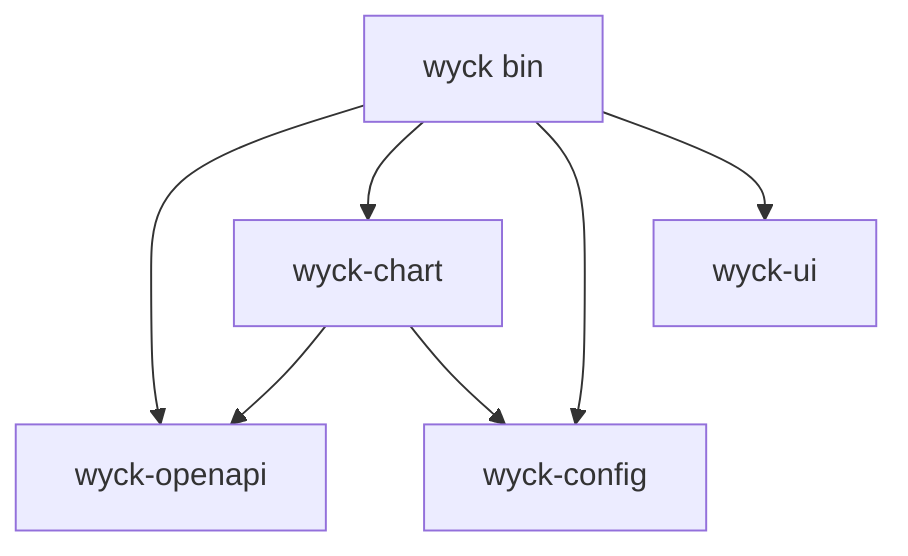

# Cross-cutting analysis

## Internal dependency graph (current)

No cycle, no upward dependency (nothing in a lower crate depends on `wyck-ui` or `gpui`). `wyck-chart` has no gpui dependency (its only mention is a comment, `scene/cmd.rs:3`). `wyck-openapi` has no internal dependency and already splits protocol from types by the `client` feature (`Cargo.toml`, `lib.rs:45-47`). The defect is placement, not direction: the lower crates hold things that belong in a domain layer, and the app crate holds pure logic.

`wyck-chart` depends on `wyck-openapi` only for market types (`Bar`, `Tick`, `Quote`, `Period`; `data.rs:7`, `flow.rs:22`, `timeframe.rs:14`), and on `wyck-config` for export presets (`export/store.rs`) and script storage (`study/custom/library.rs`).

## Redundancy matrix

| Concept | Definitions | Canonical choice |
|---|---|---|
| Candle or Bar | One: `wyck_openapi::market::Bar` (`bars.rs:132`), raw `i64` fields | `wyck-core::Bar` |
| Tick, Quote | `wyck_openapi::market::{Tick,Quote}` (`ticks.rs:31-50`); `export::Quote` (`wyck-chart/src/export.rs:172`, CSV quoting, name clash); `Dashboard::Quote` and enum `Tick` in `wyck/src/dashboard/mod.rs:143` | `wyck-core`; rename the CSV one |
| Symbol | `wyck_openapi::market::Symbol` (`symbols.rs:43`), `wyck/src/chart/mod.rs:290`, `wyck/src/multichart/mod.rs:51` (`SymbolRef`), catalog `Entry` | One `wyck-core::Symbol` |
| Timeframe or Period | `Period` (`bars.rs:17`, 14 variants) wrapped by `Timeframe` (`wyck-chart/src/timeframe.rs:17`); not a true duplicate but both carry `label()` and minutes | `Period` in core, `Timeframe` stays in chart |
| Order, Position, Deal | One each (`wyck-openapi/src/account/types.rs:343,393`) | `wyck-trading` |
| Account | `AccountBook`, `AccountInfo`, `AccountClient`, entity `Account` in the app | Keep, document in glossary |
| Money, Price, Volume | Bare `i64` and `f64`, scale in 6+ places | `wyck-core` newtypes |
| Errors | `wyck_openapi::Error` (`thiserror`), `wyck_config::Error` (`thiserror`), `LibraryError` in chart, `Result<_, String>` in 10 app places, `anyhow` only in `indicators/editor/providers.rs` | `thiserror` enums per crate, `anyhow` only at the app root |
| Config | `wyck-config` plus app preference models in `workspace/preferences.rs`, `trading/{panel,ticket}/prefs.rs` | Models near their owner, persistence through `DocumentStore` |
| Logging | `tracing` in libraries; no `println!` in libraries | OK |
| Proto to domain conversions | None (JSON, serde structs used directly in the domain) | Newtypes at the boundary |
| Number and date formatting | `wyck-ui/src/number.rs:166 format`, `wyck-chart/src/format.rs:4 trim` (only `trim` handles `-0`), `export.rs:1438 price_text`, `market/price.rs:48 format_price`, `contract.rs:108 format_price`, three `compact` functions | One price formatter in core, one compact formatter in chart |
| Theme and colors | `wyck_ui::theme`, `DesktopPalette` (`wyck/src/chart/mod.rs:823`), drawing colors as `u32` | `wyck-ui::theme` as the base, chart palette derived |
| Buttons and inputs | `wyck_ui::button`, gpui-kit `Button` used directly 83 times, `TextInput` vs `InputState` | `wyck-ui` only |

## Responsibility map

| Responsibility | Today | Target |
|---|---|---|
| Price, bar, tick, symbol, hours | `wyck-openapi/src/market/*` | `wyck-core` |
| Sizing, contract math | `wyck-openapi/src/trading/contract.rs`, `wyck/src/trading/math.rs`, `wyck-chart` `drawing/position.rs` | `wyck-trading` |
| Account state and PnL | `wyck-openapi/src/account/book.rs` (with UI text) | `wyck-trading`, UI text to the app |
| Risk guard, exit plans | `wyck/src/trading/{guard,plan}.rs` | `wyck-trading` |
| Indicators | `wyck-chart/src/study/**` | `wyck-indicators` |
| Alerts evaluation | `wyck/src/services/alerts/{model,eval}.rs` | `wyck-chart` or `wyck-indicators` (T-051) |
| PNG raster and history loading | `wyck/src/chart/{raster,load,live}.rs` | `wyck-chart` |
| Palettes and contrast | `wyck/src/appearance/{contrast,presets}.rs` | `wyck-ui::theme` |
| Broker protocol | `wyck-openapi` | unchanged |
| Secrets, config, backups | `wyck-config` | unchanged, cTrader parts isolated |
| UI kit | `wyck-ui` plus copies in the app | `wyck-ui` |

## End to end data flow (current)

cTrader JSON text frame -> `transport::connection::handle_text` builds an `Envelope { client_msg_id, payload_type, payload: Value }` (`wire.rs:279-291`) -> a request waiter in the `pending` map or the `broadcast` event channel (`connection.rs:94-95`) -> `event::event_from` decodes by `payload_type` (`event.rs:88-163`) -> `Session` supervises, restores subscriptions (`session/mod.rs`) -> the app `dashboard::follow_session` (`dashboard/mod.rs:468`) fans `Event::Spot` out to `multi.on_spot`, `alerts.on_spot`, `account.on_event` and `apply_spot` (`:479-487`) -> `Account` entity updates `AccountBook` and a quote cache -> views read the entity.

Orders: ticket or panel or chart action -> `Account::place_with` or `close_position` or `cancel_order` or `amend_*` -> `Account::trade` (`account.rs:888`) -> `TradingClient` (`wyck-openapi/src/trading/client.rs`) -> `NewOrderReq::validate` (`requests.rs:106`) -> rate limiter -> socket.

Type conversions and copies worth removing: raw price `i64` to `f64` in about 20 places; `OpenApiTokens` to `TokenSet` (loses `obtained_at`); quote caches in four places; `ProfileConfig` to `ClientCredentials`.

## Order path

All send, close, cancel and amend calls reach `TradingClient` from one file: `wyck/src/trading/account.rs` (`:1041,1131,1345,1405,1426,1448,1463,1484`, all through `Account::trade`). `ticket/mod.rs:1597` uses the client for margin only. UI entry points:

- New order: `ticket/mod.rs:1852 send`, `:1895 and :1913 place_batch`, Ctrl+Enter `dashboard/trade.rs:201`, reverse `account.rs:1364`.
- Close: `panel/view.rs:101,109`, `ticket/view/positions.rs:88,95`, chart line `dashboard/trade.rs:135-160`, close all `trade.rs:237`, `ticket/view.rs:399`, time stops `account.rs:1218`, toast action `account.rs:544`.
- Cancel: `panel/view.rs:406,607,1024`, `positions.rs:242`, `trade.rs:708`, OCO `account.rs:1185,1286`.
- Amend: chart drag `trade.rs:645-688`, dialogs `panel/dialogs.rs:98-108`, break even and trailing `panel/view.rs:119-127`, auto break even `account.rs:1208`.

So there is one choke point (`Account::trade`), but the policy in front of it is uneven: only new orders go through `assess`, close, cancel and amend are unguarded by design (`guard.rs:6`), confirmation rules are split (`confirm_close` in `panel/prefs.rs:318`, `one_click` in `ticket/mod.rs:1893`, none for drag edits), `assess` hardcodes `reduces: false` (`account.rs:368`), `is_live` is display only, and nothing is logged for audit.
